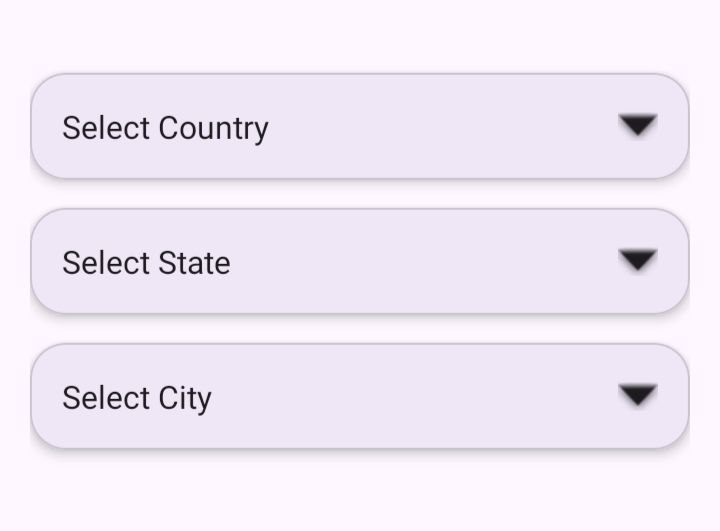
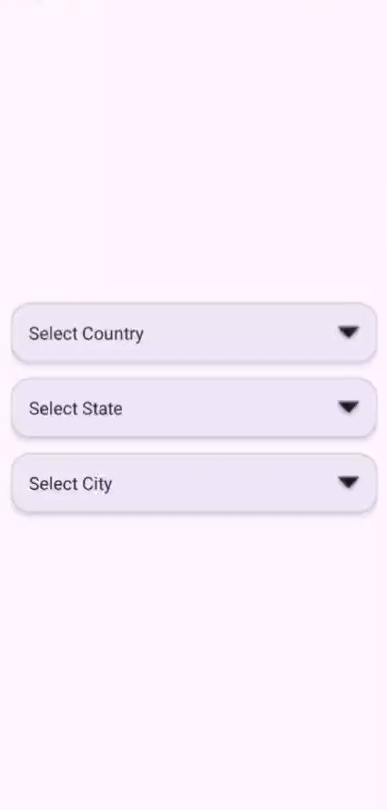
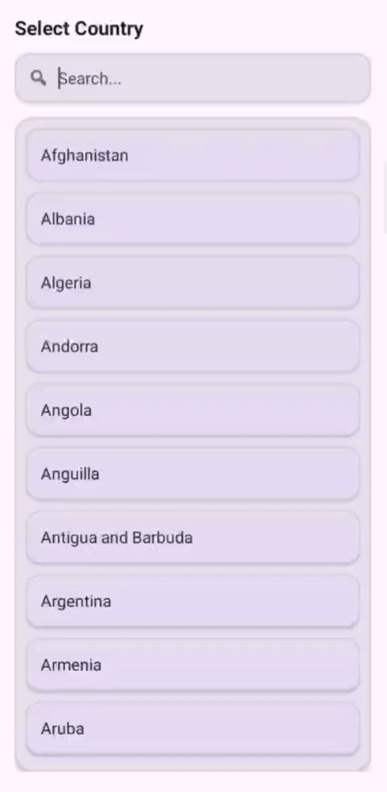

# AutoLocationPicker

[](https://kotlinlang.org/)
[](LICENSE)
[](#)

---

## AutoLocationPicker 🚀  
A modern, lightweight, auto-updating **Country → State → City Picker Library** for Android (Kotlin).  
Designed with **Material 3**, **offline caching**, **search support**, and **smooth bottom-sheet UI**.

---

## Preview

<p align="left">
  
</p>

## Demo  

<p align="center">
  
  
</p>

## Features

**✔ Auto-updating Country → State → City data**

**✔ Live API + Offline Room caching**

**✔ Search bar in all pickers**

**✔ Smooth Material BottomSheet UI**

**✔ Auto-open flow (Country → State → City)**

**✔ Dark mode supported**

**✔ Very lightweight**

**✔ Clean architecture**

**✔ Supports minSdk 24+**

## 📦 Download (JitPack)

Add JitPack repository:

```kotlin
// settings.gradle.kts
dependencyResolutionManagement {
    repositories {
        google()
        mavenCentral()
        maven("https://jitpack.io")
    }
}
```
## Implementation

**Add Dependency**
```
dependencies {
	        implementation 'com.github.Excelsior-Technologies-Community:AutoLocationPicker:1.0.2'
	}
```
---

## Usage

**Initialize Library**
```kotlin
AutoLocationPicker.init(applicationContext)
```

**Open Country Picker**
```
CountryPickerBottomSheet { countryName, countryId ->
    // Handle selected country
}
.show(supportFragmentManager, "country")
```

**Open State Picker**
```
StatePickerBottomSheet(
    countryId = selectedCountryId,
    countryName = selectedCountryName
) { stateName, stateId ->
    // Handle selected state
}
.show(supportFragmentManager, "state")
```

**Open City Picker**
```
CityPickerBottomSheet(
    countryName = selectedCountryName,
    stateName = selectedStateName,
    stateId = selectedStateId
) { cityName ->
    // Handle selected city
}
.show(supportFragmentManager, "city")
```

**Auto Flow Example (Country → State → City)**
```
CountryPickerBottomSheet { countryName, countryId ->

    StatePickerBottomSheet(countryId, countryName) { stateName, stateId ->

        CityPickerBottomSheet(countryName, stateName, stateId) { cityName ->

            // Complete selection
        }

    }.show(supportFragmentManager, "state")

}.show(supportFragmentManager, "country")
```

---

## Search Support

All pickers include a real-time search bar to filter items instantly.

## Offline Mode Support

AutoLocationPicker stores:

Countries

States

Cities

---

## Example Of Usage

```kotlin
import android.os.Bundle
import android.widget.ImageView
import android.widget.TextView
import androidx.appcompat.app.AppCompatActivity
import androidx.core.view.ViewCompat
import androidx.core.view.WindowInsetsCompat
import androidx.activity.enableEdgeToEdge
import com.ext.locationpicker.AutoLocationPicker
import com.ext.locationpicker.ui.country.CountryPickerBottomSheet
import com.ext.locationpicker.ui.state.StatePickerBottomSheet
import com.ext.locationpicker.ui.city.CityPickerBottomSheet
import com.google.android.material.card.MaterialCardView

class MainActivity : AppCompatActivity() {

    // UI Components (New Premium UI)
    private lateinit var cardCountry: MaterialCardView
    private lateinit var cardState: MaterialCardView
    private lateinit var cardCity: MaterialCardView

    private lateinit var etCountry: TextView
    private lateinit var etState: TextView
    private lateinit var etCity: TextView

    private lateinit var ivArrowCountry: ImageView
    private lateinit var ivArrowState: ImageView
    private lateinit var ivArrowCity: ImageView

    // Selected Data
    private var selectedCountryId = 0
    private var selectedStateId = 0
    private var selectedCountryName = ""
    private var selectedStateName = ""

    override fun onCreate(savedInstanceState: Bundle?) {
        super.onCreate(savedInstanceState)
        enableEdgeToEdge()
        setContentView(R.layout.activity_main)

        ViewCompat.setOnApplyWindowInsetsListener(findViewById(R.id.main)) { v, insets ->
            val systemBars = insets.getInsets(WindowInsetsCompat.Type.systemBars())
            v.setPadding(systemBars.left, systemBars.top, systemBars.right, systemBars.bottom)
            insets
        }

        // Init Library
        AutoLocationPicker.init(applicationContext)

        // Bind Views
        cardCountry = findViewById(R.id.cardCountry)
        cardState = findViewById(R.id.cardState)
        cardCity = findViewById(R.id.cardCity)

        etCountry = findViewById(R.id.etCountry)
        etState = findViewById(R.id.etState)
        etCity = findViewById(R.id.etCity)

        ivArrowCountry = findViewById(R.id.ivArrowCountry)
        ivArrowState = findViewById(R.id.ivArrowState)
        ivArrowCity = findViewById(R.id.ivArrowCity)

        // COUNTRY CLICK → AUTO OPEN STATE
        cardCountry.setOnClickListener {

            rotateArrow(ivArrowCountry, true)

            CountryPickerBottomSheet { countryName, countryId ->

                // Save Country
                rotateArrow(ivArrowCountry, false)

                selectedCountryName = countryName
                selectedCountryId = countryId
                etCountry.text = countryName

                // Reset State & City
                selectedStateId = 0
                selectedStateName = ""
                etState.text = "Select State"
                etCity.text = "Select City"

                // AUTO OPEN STATE
                rotateArrow(ivArrowState, true)

                StatePickerBottomSheet(
                    countryId = selectedCountryId,
                    countryName = selectedCountryName
                ) { stateName, stateId ->

                    rotateArrow(ivArrowState, false)

                    selectedStateName = stateName
                    selectedStateId = stateId
                    etState.text = stateName

                    // AUTO OPEN CITY
                    rotateArrow(ivArrowCity, true)

                    CityPickerBottomSheet(
                        countryName = selectedCountryName,
                        stateName = selectedStateName,
                        stateId = selectedStateId
                    ) { cityName ->

                        rotateArrow(ivArrowCity, false)
                        etCity.text = cityName

                        // (Optional) Save to session if using SharedPreferences
                        // session.saveLocation(...)
                    }.show(supportFragmentManager, "city")

                }.show(supportFragmentManager, "state")

            }.show(supportFragmentManager, "country")
        }
    }

    // Smooth Arrow Rotation Animation
    private fun rotateArrow(arrow: ImageView, expand: Boolean) {
        arrow.animate()
            .rotation(if (expand) 180f else 0f)
            .setDuration(200)
            .start()
    }
}
```

## License

```
MIT License

Copyright (c) 2025 Excelsior Technologies 

Permission is hereby granted, free of charge, to any person obtaining a copy
of this software and associated documentation files (the "Software"), to deal
in the Software without restriction, including without limitation the rights
to use, copy, modify, merge, publish, distribute, sublicense, and/or sell
copies of the Software, and to permit persons to whom the Software is
furnished to do so, subject to the following conditions:

The above copyright notice and this permission notice shall be included in all
copies or substantial portions of the Software.

THE SOFTWARE IS PROVIDED "AS IS", WITHOUT WARRANTY OF ANY KIND, EXPRESS OR
IMPLIED, INCLUDING BUT NOT LIMITED TO THE WARRANTIES OF MERCHANTABILITY,
FITNESS FOR A PARTICULAR PURPOSE AND NONINFRINGEMENT. IN NO EVENT SHALL THE
AUTHORS OR COPYRIGHT HOLDERS BE LIABLE FOR ANY CLAIM, DAMAGES OR OTHER
LIABILITY, WHETHER IN AN ACTION OF CONTRACT, TORT OR OTHERWISE, ARISING FROM,
OUT OF OR IN CONNECTION WITH THE SOFTWARE OR THE USE OR OTHER DEALINGS IN THE
SOFTWARE.

```


